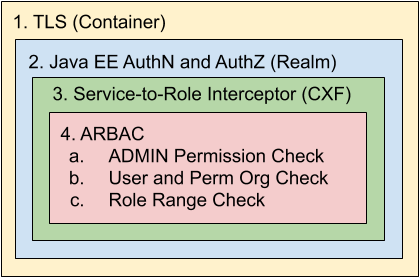

   Licensed to the Apache Software Foundation (ASF) under one
   or more contributor license agreements.  See the NOTICE file
   distributed with this work for additional information
   regarding copyright ownership.  The ASF licenses this file
   to you under the Apache License, Version 2.0 (the
   "License"); you may not use this file except in compliance
   with the License.  You may obtain a copy of the License at

     http://www.apache.org/licenses/LICENSE-2.0

   Unless required by applicable law or agreed to in writing,
   software distributed under the License is distributed on an
   "AS IS" BASIS, WITHOUT WARRANTIES OR CONDITIONS OF ANY
   KIND, either express or implied.  See the License for the
   specific language governing permissions and limitations
   under the License.

# README for Apache Fortress REST Security Model


/home/smckinn/GIT/fortressDev/directory-fortress-enmasse/images/ApacheFortressRestSecurityModel.png

## Table of Contents

 * Document Overview
 * Understand the security model of Apache Fortress Rest
 * SECTION 1. TLS
 * SECTION 2. Java EE security
 * SECTION 3. Apache CXF's **SimpleAuthorizingInterceptor**
 * SECTION 4. Apache Fortress **ARBAC Checks**
 * SECTION 5. Java EE security and Apache CXF SimpleAuthorizingInterceptor policy load
 * SECTION 6. ARBAC policy load
 * SECTION 7. The list of Services that enforce ARBAC02

## Document Overview

 Provides a description of the various security mechanisms that are performed during Apache Fortress REST runtime operations.
## Understand the security model of Apache Fortress Rest

### A Typical Deployment

   (**Client**)<---https--->(**FortressRest**)<-in-process->(**FortressCore**)<---ldaps--->(**DirectoryServer**)

 * Consists of three tiers: 1. **Client**, 2. Servlet Container hosting **FortressRest**, and 3. **DirectoryServer** that stores the policy information.
 * The **Client** is any HTTP interface that supports the Apache Fortress message formats.
 * **FortressRest** is a web application archive (.war) that deploys into a Servlet Container, i.e. Apache Tomcat.
 * **FortressCore** is a set of APIs that get embedded inside of Java apps (like FortressRest).
 * **DirectoryServer** is a process implementing LDAPv3 protocols, e.g. ApacheDS or OpenLDAP.

### High-level Security Flow
 * The user credentials are introduced into the call chain by the Client as a standard HTTP basic auth header.
 * Passed into the Servlet Container for authentication and coarse-grained authorization before dispatch to FortressRest.
 * Medium-grained authorization performed inside FortressRest as the service dispatches.
 * Finally, if ARBAC enabled (more later), the credentials are converted to an RBAC session and passed into the FortressCore for fine-grained checks.

### Apache Fortress Rest security model includes:

### 1. TLS

 Be sure to use because it allows confidentiality of credentials and message content via HTTPS. Refer to the documentation of your servlet container for how to enable.

## 2. Java EE security

 * FortressRest uses the [Apache Fortress Realm](https://github.com/apache/directory-fortress-realm) to provide Java EE authentication, coarse-grained authorization mapping the users and roles back to a given LDAP server.
 * This interface requires standard HTTP Basic Auth tokens for the userid/password credentials.
 * The credentials are verified by the Apache Fortress Realm via bind op invocation to the Directory Server.
 * The coarse-grained authorization policy ensures callers have the RBAC Role **fortress-rest-user**.
 * Can be changed via the deployment descriptor, [web.xml](src/main/webapp/WEB-INF/web.xml).

## 3. Apache CXF's **SimpleAuthorizingInterceptor**

 This policy enforcement mechanism maps RBAC roles to a given set of services.  The following table shows what roles map to which (sets of) services:

| service type      | fortress-rest-super-user | fortress-rest-admin-user | fortress-rest-review-user | fortress-rest-access-user | fortress-rest-deladmin-user | fortress-rest-delreview-user | fortress-rest-delaccess-user | fortress-rest-pwmgr-user | fortress-rest-audit-user | fortress-rest-config-user |
| ----------------- | ------------------------ | ------------------------ | ------------------------- | ------------------------- | --------------------------- | ---------------------------- | ---------------------------- | ------------------------ | ------------------------ | ------------------------- |
| Admin  Manager    | true                     | true                     | false                     | false                     | false                       | false                        | false                        | false                    | false                    | false                     |
| Review Manager    | true                     | false                    | true                      | false                     | false                       | false                        | false                        | false                    | false                    | false                     |
| Access Manager    | true                     | false                    | false                     | true                      | false                       | false                        | false                        | false                    | false                    | false                     |
| Delegated Admin   | true                     | false                    | false                     | false                     | true                        | false                        | false                        | false                    | false                    | false                     |
| Delegated Review  | true                     | false                    | false                     | false                     | false                       | true                         | false                        | false                    | false                    | false                     |
| Delegated Access  | true                     | false                    | false                     | false                     | false                       | false                        | true                         | false                    | false                    | false                     |
| Password  Manager | true                     | false                    | false                     | false                     | false                       | false                        | false                        | true                     | false                    | false                     |
| Audit  Manager    | true                     | false                    | false                     | false                     | false                       | false                        | false                        | false                    | true                     | false                     |
| Config  Manager   | true                     | false                    | false                     | false                     | false                       | false                        | false                        | false                    | false                    | true                      |

 * The service-to-role mappings are performed inside the [FortressServiceImpl](src/main/java/org/apache/directory/fortress/rest/FortressServiceImpl.java) module.
 * For example, the deleteUser service:
 ```
 @POST
 @Path("/userDelete/")
 @RolesAllowed({"fortress-rest-super-user", "fortress-rest-admin-user"})
 public FortResponse deleteUser...
 ```
 * The caller needs either *fortress-rest-super-user* or *fortress-rest-admin-user* RBAC role to invoke the specified service.

## 4. Apache Fortress **ARBAC Checks**

 The Apache Fortress Administrative Role-Based Access Control (ARBAC) subsystem handles delegating administrative tasks to special users.
 Disabled in FortressRest by default, to enable, add the following declaration to the fortress.properties:

 ```
 is.arbac02=true
 ```

a. When enabled, all service invocations perform an ADMIN permission verification by invoking [DelAccessMgr.checkAccess](https://directory.apache.org/fortress/gen-docs/latest/apidocs/org/apache/directory/fortress/core/DelAccessMgr.html#checkAccess-org.apache.directory.fortress.core.model.Session-org.apache.directory.fortress.core.model.Permission-) down in the API layer.
 
 For example, the permission with an objectName: **org.apache.directory.fortress.core.impl.AdminMgrImpl** and operation name: **addUser** is automatically checked
 during the call to the **userAdd** service.
    
 This means at least one ADMIN role must be activated for the user calling the service that has been granted the required permission.
 The entire list of permissions, and their mappings to services are listed in the table that follows.

b. Some services (#'s 1 - 12 in ARBAC table below) perform organizational verification, comparing the org on the ADMIN role with that on the target user or permission in the HTTP request.
 There are two types of organizations being checked, User and Permission.  
 
 For example, **roleAsgn** and **roleDeasgn**  (9 and 10 in ARBAC table) will verify that the caller has an ADMIN role with a user org unit that matches the ou of the target user.
 There is a similar check on **roleGrant** and **roleRevoke** (11 and 12) verifying the caller has an activated ADMIN role with a perm org unit that matches the ou on the target permission.

c. Some services (#'s 9,10,11,12 in ARBAC table) perform a range check on the target RBAC role to verify user has matching ADMIN role with authority to assign to user or grant to permission.
 The Apache Fortress REST **roleAsgn**, **roleDeasgn**, **roleGrant** and **roleRevoke** services will enforce ADMIN authority over the particular RBAC role that is being targeted in the HTTP request. 
 These checks are based on a (hierarchical) range of roles, for which the target role must fall inside.   
 
 For example, the following top-down contains a sample RBAC role hierarchy for a fictional software development organization:

 ```
        CTO
         |
     |       |
    ENG      QC
   |   |   |    |   
  E1   E2  Q1   Q2
     |        |
    DA        QA
         |
         A1
 ```
    
 Here a role called *CTO* is the highest ascendant in the graph, and *A1* is the lowest descendant. In a top-down role hierarchy, privilege increases as we descend downward.  So a person with role *A1* inherits all that are above.

 In describing a range of roles, *beginRange* is the lowest descendant in the chain, and *endRange* the highest. Furthermore a bracket, '[', ']', indicates inclusiveness with an endpoint, whereas parenthesis, '(', ')' will exclude a corresponding endpoint.

 Some example ranges that can be derived from the sample role graph above:

 * [A1, CTO] is the full set: {CTO, ENG, QC, E1, E2, Q1, Q2, DA, QA, A1}. 
 * (A1, CTO) is the full set, minus the endpoints: {ENG, QC, E1, E2, Q1, Q2, DA, QA}. 
 * [A1, ENG] includes: {A1, DA, E1, E2, ENG}, 
 * [A1, ENG) includes: {A1, DA, E1, E2}. 
 * (QA, QC] has {Q1, Q2, QC} in its range.
 * etc... 

 For an administrator to be authorized to target an RBAC role in one of the specified APIs listed above, at least one of their activated ADMIN roles must pass the ARBAC role range test.  There are currently two roles 
 created by the security policy in this project, that are excluded from this type of check:
 **fortress-rest-admin** and **fortress-core-super-admin**. 

 Which means they won't have to pass the role range test.  All others use the range field to define authority over a particular set of roles, in a hierarchical structure.

## 5. Java EE security and Apache CXF *SimpleAuthorizingInterceptor* policy load

 a. The policy load file in this section performs the following:
  * Creates the RBAC Role, *fortress-rest-user* for the Java EE simple role check (described earlier). See [web.xml](src/main/webapp/WEB-INF/web.xml).
  * Create the RBAC Roles for the Apache CXF **SimpleAuthorizingInterceptor** checks (also described earlier). See [FortressInterceptor](src/main/java/org/apache/directory/fortress/rest/FortressInterceptor.java).
    * For example...
    * Users assigned to *fortress-rest-admin-user* have access to every RBAC admin service. e.g. addUser, addRole, addPermission
    * "        "        *fortress-rest-review-user* have access to every RBAC review services. e.g. readUser, readRole, readPermission
    * "        "        *fortress-rest-deladmin-user* have access to every ARBAC admin services.
    * etc...
  * Create an RBAC Role, *fortress-rest-power-user*, and make it the child of every other RBAC role.
    * Users assigned to this Role have access to every service.
  * Create a test user, *demoUser4*, assign to *fortress-rest-power-user* RBAC role.

 b. Execute the policy load [FortressRestServerPolicy](./src/main/resources/FortressRestServerPolicy.xml) into LDAP:

 ```maven
 mvn install -Dload.file=src/main/resources/FortressRestServerPolicy.xml
 ```

 c. Now *demoUser4* may execute every service and pass the JavaEE and Apache CXF interceptor checks.

## 6. ARBAC policy load

 a. The ARBAC policies are enforced when the following property is present in runtime *fortress.properties*:
 ```
# Boolean value. Disabled by default. If this is set to true, the runtime will enforce administrative permissions and ARBAC02 DA checks:
is.arbac02=true
 ```

 b. The policy load file in this section Creates an ADMIN Role named: *fortress-rest-admin*, and associates with (Test) Perm and User OUs:

 ```
PermOUs="APP0,APP1,APP2,APP3,APP4,APP5,APP6,APP7,APP8,APP9,APP10,
      oamT3POrg8,oamT3POrg9,oamT3POrg1,oamT3POrg10,oamT3POrg2,
      oamT3POrg3,oamT3POrg4,oamT3POrg5,oamT3POrg6,oamT3POrg7,
      oamT3POrg8,oamT4POrg1,oamT4POrg10,oamT4POrg2,oamT4POrg3,
      oamT4POrg4,oamT4POrg5,oamT4POrg6,oamT4POrg7,oamT4POrg8,
      oamT4POrg9,T5POrg1,T5POrg2,T5POrg3,T5POrg4,T5POrg5,T6POrg1,
      T6POrg2,T6POrg3,T6POrg4,T6POrg5,T6POrg6,T6POrg7,T7POrg1,T7POrg2,
      T7POrg3,T7POrg4,T7POrg5,T7POrg6,T7POrg7"

UserOUs="DEV0,DEV1,DEV2,DEV3,DEV4,DEV5,DEV6,DEV7,DEV8,DEV9,DEV10,
      oamT1UOrg1,oamT1UOrg10,oamT1UOrg2,oamT1UOrg3,oamT1UOrg4,
      oamT1UOrg5,oamT1UOrg6,oamT1UOrg7,oamT1UOrg8,oamT1UOrg9,
      oamT2UOrg1,oamT2UOrg10,oamT2UOrg2,oamT2UOrg3,oamT2UOrg4,
      oamT2UOrg5,oamT2UOrg6,oamT2UOrg7,oamT2UOrg8,oamT2UOrg9,
      T5UOrg1,T5UOrg2,T5UOrg3,T5UOrg4,T5UOrg5,T6UOrg1,T6UOrg2,
      T6UOrg3,T6UOrg4,T6UOrg5,T6UOrg6,T6UOrg7,T7UOrg1,T7UOrg2,
      T7UOrg3,T7UOrg4,T7UOrg5,T7UOrg6,T7UOrg7"
 ```
 Note: The Perm and User OUs must be created prior to the ARBAC sample load script being run.
 They get created during Apache Fortress Core integration testing. See [FortressJUnitTest](https://github.com/apache/directory-fortress-core/blob/master/src/test/java/org/apache/directory/fortress/core/impl/FortressJUnitTest.java).

 c. Next, the ARBAC sample policy load script performs:

 * Create one ADMIN Permission for every Apache Fortress Rest service.
 * Grant every ADMIN Perm to the ADMIN Role *fortress-rest-admin*.
 * Assign the ADMIN Role *fortress-rest-admin* to test User *demoUser4*.
 * Users who have been assigned *fortress-rest-admin*, like *demoUser4*, may...
   * call every Apache Fortress Rest service in this system and pass the ARBAC perm checks.
   * pass the ARBAC Org checks for (only) the data contained within the Apache Fortress core junit tests.
   * pass *any/all* Role range checks.

 d. To load the [FortressRestArbacSamplePolicy](./src/main/resources/FortressRestArbacSamplePolicy.xml) into LDAP:

 ```maven
 mvn install -Dload.file=src/main/resources/FortressRestArbacSamplePolicy.xml
 ```

 e. Now *demoUser4* may invoke every service in the subsystem and pass all of the ARBAC checks corresponding with the test data inside of Apache Fortress Core's integration test suite.

## 7. The list of Services that enforce ARBAC checking.

|  #  | **Services**                   | UserOU Check | PermOU Check | Role Range Check | **ADMIN Permissions**                                                                             | 
| --- | ------------------------------ | ------------ | ------------ | ---------------- | ------------------------------------------------------------------------------------------------- |
|   1 | userAdd                        | true         | false        | false            | objName="org.apache.directory.fortress.core.impl.AdminMgrImpl" opName="addUser"                   |
|   2 | userUpdate                     | true         | false        | false            | objName="org.apache.directory.fortress.core.impl.AdminMgrImpl" opName="updateUser"                |
|   3 | userDelete                     | true         | false        | false            | objName="org.apache.directory.fortress.core.impl.AdminMgrImpl" opName="deleteUser"                | 
|   4 | userDisable                    | true         | false        | false            | objName="org.apache.directory.fortress.core.impl.AdminMgrImpl" opName="disableUser"               |
|   5 | userChange                     | true         | false        | false            | objName="org.apache.directory.fortress.core.impl.AdminMgrImpl" opName="changePassword"            |
|   6 | userReset                      | true         | false        | false            | objName="org.apache.directory.fortress.core.impl.AdminMgrImpl" opName="resetPassword"             |
|   7 | userLock                       | true         | false        | false            | objName="org.apache.directory.fortress.core.impl.AdminMgrImpl" opName="lockUserAccount"           |
|   8 | userUnlock                     | true         | false        | false            | objName="org.apache.directory.fortress.core.impl.AdminMgrImpl" opName="unlockUserAccount"         |
|   9 | roleAsgn                       | true         | false        | true             | objName="org.apache.directory.fortress.core.impl.AdminMgrImpl" opName="assignUser"                |
|  10 | roleDeasgn                     | true         | false        | true             | objName="org.apache.directory.fortress.core.impl.AdminMgrImpl" opName="deassignUser"              |
|  11 | roleGrant                      | false        | true         | true             | objName="org.apache.directory.fortress.core.impl.AdminMgrImpl" opName="grantPermission"           |
|  12 | roleRevoke                     | false        | true         | true             | objName="org.apache.directory.fortress.core.impl.AdminMgrImpl" opName="revokePermission"          |
|  13 | roleAdd                        | false        | false        | false            | objName="org.apache.directory.fortress.core.impl.AdminMgrImpl" opName="addRole"                   |
|  14 | roleDelete                     | false        | false        | false            | objName="org.apache.directory.fortress.core.impl.AdminMgrImpl" opName="deleteRole"                |
|  15 | roleUpdate                     | false        | false        | false            | objName="org.apache.directory.fortress.core.impl.AdminMgrImpl" opName="updateRole"                |
|  16 | addRoleConstraint              | false        | false        | false            | objName="org.apache.directory.fortress.core.impl.AdminMgrImpl" opName="addRoleConstraint"         |
|  17 | removeRoleConstraint           | false        | false        | false            | objName="org.apache.directory.fortress.core.impl.AdminMgrImpl" opName="removeRoleConstraint"      |
|  18 | roleEnableConstraint           | false        | false        | false            | objName="org.apache.directory.fortress.core.impl.AdminMgrImpl" opName="enableRoleConstraint"      |
|  19 | roleDisableConstraint          | false        | false        | false            | objName="org.apache.directory.fortress.core.impl.AdminMgrImpl" opName="disableRoleConstraint"     |
|  20 | permAdd                        | false        | false        | false            | objName="org.apache.directory.fortress.core.impl.AdminMgrImpl" opName="addPermission"             |
|  21 | objAdd                         | false        | false        | false            | objName="org.apache.directory.fortress.core.impl.AdminMgrImpl" opName="addPermObj"                |
|  22 | permDelete                     | false        | false        | false            | objName="org.apache.directory.fortress.core.impl.AdminMgrImpl" opName="deletePermission"          |
|  23 | objDelete                      | false        | false        | false            | objName="org.apache.directory.fortress.core.impl.AdminMgrImpl" opName="deletePermObj"             |
|  24 | permUpdate                     | false        | false        | false            | objName="org.apache.directory.fortress.core.impl.AdminMgrImpl" opName="updatePermission"          |
|  25 | objUpdate                      | false        | false        | false            | objName="org.apache.directory.fortress.core.impl.AdminMgrImpl" opName="updatePermObj"             |
|  26 | userGrant                      | false        | false        | false            | objName="org.apache.directory.fortress.core.impl.AdminMgrImpl" opName="grantPermissionUser"       |
|  27 | userRevoke                     | false        | false        | false            | objName="org.apache.directory.fortress.core.impl.AdminMgrImpl" opName="revokePermissionUser"      |
|  28 | roleDescendant                 | false        | false        | false            | objName="org.apache.directory.fortress.core.impl.AdminMgrImpl" opName="addDescendant"             |
|  29 | roleAscendent                  | false        | false        | false            | objName="org.apache.directory.fortress.core.impl.AdminMgrImpl" opName="addAscendant"              |
|  30 | roleAddinherit                 | false        | false        | false            | objName="org.apache.directory.fortress.core.impl.AdminMgrImpl" opName="addInheritance"            |
|  31 | roleDelinherit                 | false        | false        | false            | objName="org.apache.directory.fortress.core.impl.AdminMgrImpl" opName="deleteInheritance"         |
|  32 | ssdAdd                         | false        | false        | false            | objName="org.apache.directory.fortress.core.impl.AdminMgrImpl" opName="createSsdSet"              |
|  33 | ssdUpdate                      | false        | false        | false            | objName="org.apache.directory.fortress.core.impl.AdminMgrImpl" opName="updateSsdSet"              |
|  34 | ssdAddMember                   | false        | false        | false            | objName="org.apache.directory.fortress.core.impl.AdminMgrImpl" opName="addSsdRoleMember"          |
|  35 | ssdDelMember                   | false        | false        | false            | objName="org.apache.directory.fortress.core.impl.AdminMgrImpl" opName="deleteSsdRoleMember"       |
|  36 | ssdDelete                      | false        | false        | false            | objName="org.apache.directory.fortress.core.impl.AdminMgrImpl" opName="deleteSsdSet"              |
|  37 | ssdCardUpdate                  | false        | false        | false            | objName="org.apache.directory.fortress.core.impl.AdminMgrImpl" opName="setSsdSetCardinality"      |
|  38 | dsdAdd                         | false        | false        | false            | objName="org.apache.directory.fortress.core.impl.AdminMgrImpl" opName="createDsdSet"              |
|  39 | dsdUpdate                      | false        | false        | false            | objName="org.apache.directory.fortress.core.impl.AdminMgrImpl" opName="updateDsdSet"              |
|  40 | dsdAddMember                   | false        | false        | false            | objName="org.apache.directory.fortress.core.impl.AdminMgrImpl" opName="addDsdRoleMember"          |
|  41 | dsdDelMember                   | false        | false        | false            | objName="org.apache.directory.fortress.core.impl.AdminMgrImpl" opName="deleteDsdRoleMember"       |
|  42 | dsdDelete                      | false        | false        | false            | objName="org.apache.directory.fortress.core.impl.AdminMgrImpl" opName="deleteDsdSet"              |
|  43 | dsdCardUpdate                  | false        | false        | false            | objName="org.apache.directory.fortress.core.impl.AdminMgrImpl" opName="setDsdSetCardinality"      |
|  44 | addPermissionAttributeSet      | false        | false        | false            | objName="org.apache.directory.fortress.core.impl.AdminMgrImpl" opName="addPermissionAttributeSet" |
|  45 | deletePermissionAttributeSet   | false        | false        | false            | objName="org.apache.directory.fortress.core.impl.AdminMgrImpl" opName="deletePermissionAttributeSet"|
|  46 | addPermissionAttributeToSet    | false        | false        | false            | objName="org.apache.directory.fortress.core.impl.AdminMgrImpl" opName="addPermissionAttributeToSet" |
|  47 | permRead                       | false        | false        | false            | objName="org.apache.directory.fortress.core.impl.ReviewMgrImpl" opName="readPermission"           |
|  48 | objRead                        | false        | false        | false            | objName="org.apache.directory.fortress.core.impl.ReviewMgrImpl" opName="readPermObj"              |
|  49 | permSearch                     | false        | false        | false            | objName="org.apache.directory.fortress.core.impl.ReviewMgrImpl" opName="findPermissions"          |
|  50 | objSearch                      | false        | false        | false            | objName="org.apache.directory.fortress.core.impl.ReviewMgrImpl" opName="findPermObjs"             |
|  51 | permObjSearch                  | false        | false        | false            | objName="org.apache.directory.fortress.core.impl.ReviewMgrImpl" opName="findPermsByObj"           |
|  52 | roleRead                       | false        | false        | false            | objName="org.apache.directory.fortress.core.impl.ReviewMgrImpl" opName="readRole"                 |
|  53 | roleSearch                     | false        | false        | false            | objName="org.apache.directory.fortress.core.impl.ReviewMgrImpl" opName="findRoles"                |
|  54 | userRead                       | false        | false        | false            | objName="org.apache.directory.fortress.core.impl.ReviewMgrImpl" opName="readUser"                 |
|  55 | userSearch                     | false        | false        | false            | objName="org.apache.directory.fortress.core.impl.ReviewMgrImpl" opName="findUsers"                |
|  56 | userAsigned                    | false        | false        | false            | objName="org.apache.directory.fortress.core.impl.ReviewMgrImpl" opName="assignedUsers"            |
|  57 | roleAsigned                    | false        | false        | false            | objName="org.apache.directory.fortress.core.impl.ReviewMgrImpl" opName="assignedRoles"            |
|  58 | roleAuthzed                    | false        | false        | false            | objName="org.apache.directory.fortress.core.impl.ReviewMgrImpl" opName="authorizedRoles"          |
|  59 | userAuthzed                    | false        | false        | false            | objName="org.apache.directory.fortress.core.impl.ReviewMgrImpl" opName="authorizedUsers"          |
|  60 | rolePerms                      | false        | false        | false            | objName="org.apache.directory.fortress.core.impl.ReviewMgrImpl" opName="rolePermissions"          |
|  61 | userPerms                      | false        | false        | false            | objName="org.apache.directory.fortress.core.impl.ReviewMgrImpl" opName="userPermissions"          |
|  62 | permRoles                      | false        | false        | false            | objName="org.apache.directory.fortress.core.impl.ReviewMgrImpl" opName="permissionRoles"          |
|  63 | permRolesAuthzed               | false        | false        | false            | objName="org.apache.directory.fortress.core.impl.ReviewMgrImpl" opName="authorizedPermissionRoles"|
|  64 | permUsers                      | false        | false        | false            | objName="org.apache.directory.fortress.core.impl.ReviewMgrImpl" opName="permissionUsers"          |
|  65 | permUsersAuthzed               | false        | false        | false            | objName="org.apache.directory.fortress.core.impl.ReviewMgrImpl" opName="authorizedPermissionUsers"|
|  66 | ssdRoleSets                    | false        | false        | false            | objName="org.apache.directory.fortress.core.impl.ReviewMgrImpl" opName="ssdRoleSets"              |
|  67 | ssdRead                        | false        | false        | false            | objName="org.apache.directory.fortress.core.impl.ReviewMgrImpl" opName="ssdRoleSet"               |
|  68 | ssdRoles                       | false        | false        | false            | objName="org.apache.directory.fortress.core.impl.ReviewMgrImpl" opName="ssdRoleSetRoles"          |
|  69 | ssdCard                        | false        | false        | false            | objName="org.apache.directory.fortress.core.impl.ReviewMgrImpl" opName="ssdRoleSetCardinality"    |
|  70 | dsdRoleSets                    | false        | false        | false            | objName="org.apache.directory.fortress.core.impl.ReviewMgrImpl" opName="dsdRoleSets"              |
|  71 | dsdSets                        | false        | false        | false            | objName="org.apache.directory.fortress.core.impl.ReviewMgrImpl" opName="ssdSets"                  |
|  72 | dsdRead                        | false        | false        | false            | objName="org.apache.directory.fortress.core.impl.ReviewMgrImpl" opName="dsdRoleSet"               |
|  73 | dsdRoles                       | false        | false        | false            | objName="org.apache.directory.fortress.core.impl.ReviewMgrImpl" opName="dsdRoleSetRoles"          |
|  74 | dsdCard                        | false        | false        | false            | objName="org.apache.directory.fortress.core.impl.ReviewMgrImpl" opName="dsdRoleSetCardinality"    |
|  75 | dsdSets                        | false        | false        | false            | objName="org.apache.directory.fortress.core.impl.ReviewMgrImpl" opName="dsdSets"                  |
|  76 | readPermAttributeSet           | false        | false        | false            | objName="org.apache.directory.fortress.core.impl.ReviewMgrImpl" opName="readPermAttributeSet"     |
|  77 | findRoleConstraints            | false        | false        | false            | objName="org.apache.directory.fortress.core.impl.ReviewMgrImpl" opName="findRoleConstraints"      |
|  78 | arleAdd                        | false        | false        | false            | objName="org.apache.directory.fortress.core.impl.DelAdminMgrImpl" opName="addRole"                |
|  79 | arleDelete                     | false        | false        | false            | objName="org.apache.directory.fortress.core.impl.DelAdminMgrImpl" opName="deleteRole"             |
|  80 | arleUpdate                     | false        | false        | false            | objName="org.apache.directory.fortress.core.impl.DelAdminMgrImpl" opName="updateRole"             |
|  81 | adminAssign                    | false        | false        | false            | objName="org.apache.directory.fortress.core.impl.DelAdminMgrImpl" opName="assignUser"             |
|  82 | adminDeassign                  | false        | false        | false            | objName="org.apache.directory.fortress.core.impl.DelAdminMgrImpl" opName="deassignUser"           |
|  83 | orgAdd                         | false        | false        | false            | objName="org.apache.directory.fortress.core.impl.DelAdminMgrImpl" opName="addOU"                  |
|  84 | orgUpdate                      | false        | false        | false            | objName="org.apache.directory.fortress.core.impl.DelAdminMgrImpl" opName="updateOU"               |
|  85 | orgDelete                      | false        | false        | false            | objName="org.apache.directory.fortress.core.impl.DelAdminMgrImpl" opName="deleteOU"               |
|  86 | orgDescendant                  | false        | false        | false            | objName="org.apache.directory.fortress.core.impl.DelAdminMgrImpl" opName="addDescendantOU"        |
|  87 | orgAscendent                   | false        | false        | false            | objName="org.apache.directory.fortress.core.impl.DelAdminMgrImpl" opName="addAscendantOU"         |
|  88 | orgAddinherit                  | false        | false        | false            | objName="org.apache.directory.fortress.core.impl.DelAdminMgrImpl" opName="addInheritanceOU"       |
|  89 | orgDelinherit                  | false        | false        | false            | objName="org.apache.directory.fortress.core.impl.DelAdminMgrImpl" opName="deleteInheritanceOU"    |
|  90 | arleDescendant                 | false        | false        | false            | objName="org.apache.directory.fortress.core.impl.DelAdminMgrImpl" opName="addDescendantRole"      |
|  91 | arleAscendent                  | false        | false        | false            | objName="org.apache.directory.fortress.core.impl.DelAdminMgrImpl" opName="addAscendantRole"       |
|  92 | arleAddinherit                 | false        | false        | false            | objName="org.apache.directory.fortress.core.impl.DelAdminMgrImpl" opName="addInheritanceRole"     |
|  93 | arleDelinherit                 | false        | false        | false            | objName="org.apache.directory.fortress.core.impl.DelAdminMgrImpl" opName="deleteInheritanceRole"  |
|  94 | arleRead                       | false        | false        | false            | objName="org.apache.directory.fortress.core.impl.DelReviewMgrImpl" opName="readRole"              |
|  95 | arleSearch                     | false        | false        | false            | objName="org.apache.directory.fortress.core.impl.DelReviewMgrImpl" opName="findRoles"             |
|  96 | arleAsigned                    | false        | false        | false            | objName="org.apache.directory.fortress.core.impl.DelReviewMgrImpl" opName="assignedRoles"         |
|  97 | userAsignedAdmin               | false        | false        | false            | objName="org.apache.directory.fortress.core.impl.DelReviewMgrImpl" opName="assignedUsers"         |
|  98 | orgRead                        | false        | false        | false            | objName="org.apache.directory.fortress.core.impl.DelReviewMgrImpl" opName="readOU"                |
|  99 | orgSearch                      | false        | false        | false            | objName="org.apache.directory.fortress.core.impl.DelReviewMgrImpl" opName="searchOU"              |
| 100 | groupAdd                       | false        | false        | false            | objName="org.apache.directory.fortress.core.impl.GroupMgrImpl" opName="add"                       |
| 101 | groupUpdate                    | false        | false        | false            | objName="org.apache.directory.fortress.core.impl.GroupMgrImpl" opName="update"                    |
| 102 | groupDelete                    | false        | false        | false            | objName="org.apache.directory.fortress.core.impl.GroupMgrImpl" opName="delete"                    |
| 103 | groupAsgn                      | false        | false        | false            | objName="org.apache.directory.fortress.core.impl.GroupMgrImpl" opName="assign"                    |
| 104 | groupDeasgn                    | false        | false        | false            | objName="org.apache.directory.fortress.core.impl.GroupMgrImpl" opName="deassign"                  |
| 105 | groupRead                      | false        | false        | false            | objName="org.apache.directory.fortress.core.impl.GroupMgrImpl" opName="read"                      |
| 106 | roleGroupAsigned               | false        | false        | false            | objName="org.apache.directory.fortress.core.impl.GroupMgrImpl" opName="groupRoles"                |
| 107 | groupAsigned                   | false        | false        | false            | objName="org.apache.directory.fortress.core.impl.GroupMgrImpl" opName="roleGroups"                |
| 108 | pswdAdd                        | false        | false        | false            | objName="org.apache.directory.fortress.core.impl.PwPolicyMgrImpl" opName="add"                    |
| 109 | pswdUpdate                     | false        | false        | false            | objName="org.apache.directory.fortress.core.impl.PwPolicyMgrImpl" opName="update"                 |
| 110 | pswdDelete                     | false        | false        | false            | objName="org.apache.directory.fortress.core.impl.PwPolicyMgrImpl" opName="delete"                 |
| 111 | pswdUserAdd                    | false        | false        | false            | objName="org.apache.directory.fortress.core.impl.PwPolicyMgrImpl" opName="updateUserPolicy"       |
| 112 | pswdUserDelete                 | false        | false        | false            | objName="org.apache.directory.fortress.core.impl.PwPolicyMgrImpl" opName="deletePasswordPolicy"   |
| 113 | pswdSearch                     | false        | false        | false            | objName="org.apache.directory.fortress.core.impl.PwPolicyMgrImpl" opName="search"                 |
| 114 | pswdRead                       | false        | false        | false            | objName="org.apache.directory.fortress.core.impl.PwPolicyMgrImpl" opName="read"                   |
| 115 | auditBinds                     | false        | false        | false            | objName="org.apache.directory.fortress.core.impl.AuditMgrImpl" opName="searchBinds"               |
| 116 | auditAuthzs                    | false        | false        | false            | objName="org.apache.directory.fortress.core.impl.AuditMgrImpl" opName="searchAuthZs"              |
| 117 | auditUserAuthzs                | false        | false        | false            | objName="org.apache.directory.fortress.core.impl.AuditMgrImpl" opName="getUserAuthZs"             |
| 118 | auditSessions                  | false        | false        | false            | objName="org.apache.directory.fortress.core.impl.AuditMgrImpl" opName="searchUserSessions"        |
| 119 | auditMods                      | false        | false        | false            | objName="org.apache.directory.fortress.core.impl.AuditMgrImpl" opName="searchAdminMods"           |
| 120 | auditInvld                     | false        | false        | false            | objName="org.apache.directory.fortress.core.impl.AuditMgrImpl" opName="searchInvalidUsers"        |
|     |                                | false        | false        | false            |   |


#### END OF README