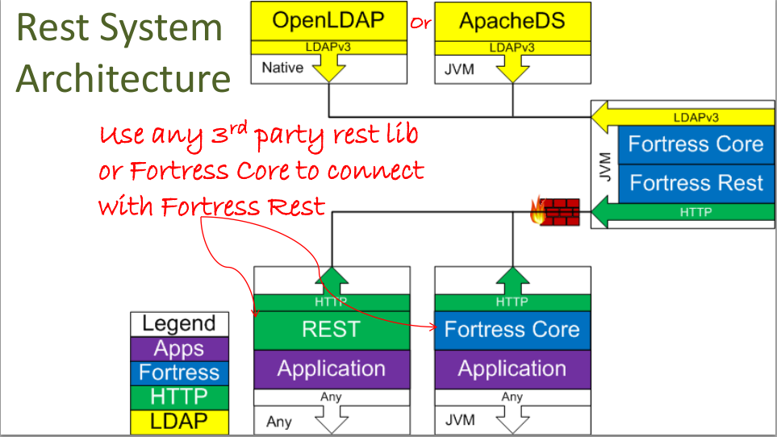

   Licensed to the Apache Software Foundation (ASF) under one
   or more contributor license agreements.  See the NOTICE file
   distributed with this work for additional information
   regarding copyright ownership.  The ASF licenses this file
   to you under the Apache License, Version 2.0 (the
   "License"); you may not use this file except in compliance
   with the License.  You may obtain a copy of the License at

     http://www.apache.org/licenses/LICENSE-2.0

   Unless required by applicable law or agreed to in writing,
   software distributed under the License is distributed on an
   "AS IS" BASIS, WITHOUT WARRANTIES OR CONDITIONS OF ANY
   KIND, either express or implied.  See the License for the
   specific language governing permissions and limitations
   under the License.

# README for Apache Fortress Rest
 * Version 2.0.3
 * Apache Fortress Rest System Architecture Diagram
 

-------------------------------------------------------------------------------
## Table of Contents

 * Document Overview
 * Tips for first-time users.
 * SECTION 1. Prerequisites.
 * SECTION 2. Download & Install.
 * SECTION 3. Prepare Tomcat for Java EE Security
 * SECTION 4. Prepare directory-fortress-rest package to use LDAP server
 * SECTION 5. Build and deploy directory-fortress-rest
 * SECTION 6. Unit Test.
 * SECTION 7. Fortress rest properties
 * SECTION 8. Understand the security model of Apache Fortress Rest

___________________________________________________________________________________
## Document Overview

This document contains instructions to download, build, and test operations using Apache Fortress Rest component.

___________________________________________________________________________________
##  Tips for first-time users

 * For a tutorial on how to use Apache Fortress with LDAP, check out the Fortress Core quickstart guides.
 * Questions about this software package should be directed to its mailing list:
   * http://mail-archives.apache.org/mod_mbox/directory-fortress/

-------------------------------------------------------------------------------
## SECTION 1. Prerequisites

Minimum hardware requirements:
 * 1 Core
 * 1GB RAM

Minimum software requirements:
 * Java 8
 * git
 * Apache Maven 3++
 * Apache Tomcat 7++
 * Basic LDAP server setup by completing one of these Quickstarts
    * [OpenLDAP & Fortress QUICKSTART](https://github.com/apache/directory-fortress-core/blob/master/README-QUICKSTART-SLAPD.md)
    * [OpenLDAP & Fortress QUICKSTART on DOCKER](https://github.com/apache/directory-fortress-core/blob/master/README-QUICKSTART-DOCKER-SLAPD.md)
    * [APACHEDS & Fortress QUICKSTART](https://github.com/apache/directory-fortress-core/blob/master/README-QUICKSTART-APACHEDS.md)
    * [APACHEDS & Fortress QUICKSTART on DOCKER](https://github.com/apache/directory-fortress-core/blob/master/README-QUICKSTART-DOCKER-APACHEDS.md)

Everything else covered in steps that follow.  Tested on Debian, Centos systems.

-------------------------------------------------------------------------------
## SECTION 2. Download & Install

#### 1. Build the source.

 a. from git:
 ```
 git clone --branch 2.0.3 https://git-wip-us.apache.org/repos/asf/directory-fortress-enmasse.git
 cd directory-fortress-enmasse
 mvn clean install
 ```

 b. or download package:

 ```
 wget http://www.apache.org/dist/directory/fortress/dist/2.0.3/fortress-rest-2.0.3-source-release.zip
 unzip fortress-rest-2.0.3.zip
 cd fortress-rest-2.0.3
 mvn clean install
 ```

#### 2. Now build the javadoc:

 ```
 mvn javadoc:javadoc
 ```

#### 3. View the generated document here: [./target/site/apidocs/overview-summary.html](./target/site/apidocs/overview-summary.html).

-------------------------------------------------------------------------------
## SECTION 3. Prepare Tomcat for Java EE Security

This web app uses Java EE security.

#### 1. Download the fortress realm proxy jar into tomcat/lib folder:

  ```bash
  wget http://repo.maven.apache.org/maven2/org/apache/directory/fortress/fortress-realm-proxy/2.0.3/fortress-realm-proxy-2.0.3.jar -P $TOMCAT_HOME/lib
  ```

 * Where `$TOMCAT_HOME` points to the execution env.

 Note: The realm proxy enables Tomcat container-managed security functions to call back to fortress.

#### 2. Optional - Prepare tomcat to allow autodeploy of rbac-abac-sample web app:

 ```bash
 sudo vi /usr/local/tomcat8/conf/tomcat-users.xml
 ```

#### 3. Optional - Add tomcat user to deploy rbac-abac-sample:

 ```xml
 <role rolename="manager-script"/>
 <user username="tcmanager" password="m@nager123" roles="manager-script"/>
 ```

#### 4. Restart tomcat for new settings to take effect.

-------------------------------------------------------------------------------
## SECTION 4. Prepare directory-fortress-rest package to use LDAP server

#### 1. Copy the fortress.properties example:

 ```bash
 cp src/main/resources/fortress.properties.example src/main/resources/fortress.properties
 ```

#### 2. Edit the file:

 ```bash
 vi src/main/resources/fortress.properties
 ```

 Pick either Apache Directory or OpenLDAP server:

 a. Prepare fortress for ApacheDS usage:

 ```properties
 # This param tells fortress what type of ldap server in use:
 ldap.server.type=apacheds

 # Use value from [Set Hostname Entry]:
 host=localhost

 # ApacheDS defaults to this:
 port=10389

 # These credentials are used for read/write access to all nodes under suffix:
 admin.user=uid=admin,ou=system
 admin.pw=secret
 ```

 -- Or --

 b. Prepare fortress for OpenLDAP usage:

 ```properties
 # This param tells fortress what type of ldap server in use:
 ldap.server.type=openldap

 # Use value from [Set Hostname Entry]:
 host=localhost

 # OpenLDAP defaults to this:
 port=389

 # These credentials are used for read/write access to all nodes under suffix:
 admin.user=cn=Manager,dc=example,dc=com
 admin.pw=secret
 ```

-------------------------------------------------------------------------------
## SECTION 5. Build and deploy directory-fortress-rest

#### 1. Verify the java and maven home env variables are set.

 ```maven
 mvn -version
 ```

 This sample requires Java 8 and Maven 3 to be setup within the execution env.

#### 2. Build and load test data:

  ```maven
 mvn install -Dload.file=ldap/setup/FortressRestServerPolicy.xml
  ```

 Build Notes:
 * `-Dload.file` automatically loads the [directory-fortress-rest security policy](src/main/resources/FortressRestServerPolicy.xml) data into ldap.
 * This load needs to happen just once for the default test cases to work and may be dropped from future `mvn` commands.

#### 3. Deploy to Tomcat:

 a. If using autodeploy feature, verify the Tomcat auto-deploy options are set correctly in the [pom.xml](pom.xml) file:
 ```xml
 <plugin>
     <groupId>org.codehaus.mojo</groupId>
     <artifactId>tomcat-maven-plugin</artifactId>
     <version>1.0-beta-1</version>
     <configuration>
     ...
         <url>http://localhost:8080/manager/text</url>
         <path>/${project.artifactId}</path>
         <username>tcmanager</username>
         <password>m@nager123</password>
     </configuration>
 </plugin>
 ```

 b. Now, automatically deploy to tomcat server:

  ```maven
 mvn clean tomcat:deploy
  ```

 c. To automatically redeploy sample app:

  ```maven
 mvn clean tomcat:redeploy
  ```

 d. To manually deploy app to Tomcat:

 ```bash
 cp target/fortress-rest-[version].war $TOMCAT_HOME/webapps
 ```

 * Where `$TOMCAT_HOME` points to the execution env.

___________________________________________________________________________________
## SECTION 6. Unit Test

Run unit test:
 ```
 mvn test -Dtest=EmTest
 ```

 Test Notes:
 * The Fortress Rest application must be deployed and running within your servlet container before the unit tests will complete successfully.  If your app server
  is running on a separate machine, or using port other than 8080, adjust the settings accordingly in src/main/test/java/org/apache/directory/fortress/rest/EmTest.java
 * For learning and troubleshooting, it is recommended that you use an HTTP proxy program, like Axis' tpMon to intercept the HTTP/XML request/responses between Fortress rest client and server.
 * The tests depend on sample security policy being loaded.

___________________________________________________________________________________
## SECTION 7. Fortress Rest properties

This section describes the properties needed to control fortress rest.

#### 1. LDAP Hostname coordinates.

 The host name can be specified as a fully qualified domain name or IP address:

 ```
 # Host name and port of LDAP DIT:
 host=localhost
 port=10389
 ```

#### 2. LDAP Server type.  Each LDAP server impl

 ```
 # If ApacheDS server:
 ldap.server.type=apacheds
 ```

 ```
 # Else if OpenLDAP server:
 ldap.server.type=slapd
 ```

 ```
 # Else leave blank:
 #ldap.server.type=other
 ```

 * note: has different behavior on operations like password policies and audit.  If using a 3rd type of server that isn't formally supported, leave blank or type is other.

#### 3.  Set the credentials of service account.

 This service account must have read/write privileges over the entire Fortress LDAP Directory Information Tree (DIT):

 ```
 # If ApacheDS it will look something like this:
 admin.user=uid=admin,ou=system
 admin.pw=secret
 ```

 ```
 # Else If OpenLDAP it will look something like this:
 admin.user=cn=Manager,dc=example,dc=com
 ```

#### 4. Define the number of LDAP connections to use in the pool

 ```
 # This is min/max settings for LDAP connections.  For testing and low-volume instances this will work:
 min.admin.conn=1
 max.admin.conn=10
 ```

 Notes on connection pools:
 * This setting will be proportional to the number of concurrent users but won't be one-to-one.
 * The number of required ldap connections will be much lower than concurrent users.

#### 5. Give coordinates to the Config node that contains all of the other Fortress properties.

 This will match your LDAP's server's config node per Fortress Core setup:

 ```
 # This node contains fortress properties stored on behalf of connecting LDAP clients:
 config.realm=DEFAULT
 config.root=ou=Config,dc=example,dc=com
 ```

#### 6. If using LDAPS.

 ```
 # Used for SSL Connection to LDAP Server:
 enable.ldap.ssl=true
 enable.ldap.ssl.debug=true
 trust.store=/fully/qualified/path/and/file/name/to/java/truststore
 trust.store.password=changeit
 trust.store.set.prop=true
 ```

#### 7. If using ApacheDS and setting password policies, point to the correction location.

 ```
 # ApacheDS stores its password policies objects here by default:
 apacheds.pwpolicy.root=ou=passwordPolicies,ads-interceptorId=authenticationInterceptor,ou=interceptors,ads-directoryServiceId=default,ou=config
 ```

-------------------------------------------------------------------------------
## SECTION 8. Understand the security model of Apache Fortress Rest

 * Apache Fortress Rest is a JAX-RS Web application that allows the Apache Fortress Core APIs to be called over an HTTP interface.
 * It deploys inside of any compliant Java Servlet container although here we'll be using Apache Tomcat.

### Apache Fortress Rest security model includes:

### TLS

Nothing special or unique going on here.  Refer to the documentation of your servlet container for how to enable.

### Java EE security

 * Apache Fortress Rest uses the [Apache Fortress Realm](https://github.com/apache/directory-fortress-realm) to provide Java EE authentication, coarse-grained authorization mapping the users and roles back to a given LDAP server.
 * The policy for Apache Fortress Rest is simple.  Any user with the **fortress-rest-user** role and correct credentials is allowed in.
 * The Fortress Rest interface uses HTTP Basic Auth tokens to send the userid/password.

### Apache CXF's **SimpleAuthorizingInterceptor**

This enforcement mechanism maps roles to a given set of services.  The following table shows what roles map to which (sets of) services:

| service type      | fortress-rest-super-user | fortress-rest-admin-user | fortress-rest-review-user | fortress-rest-access-user | fortress-rest-deladmin-user | fortress-rest-delreview-user | fortress-rest-delaccess-user | fortress-rest-pwmgr-user | fortress-rest-audit-user | fortress-rest-config-user |
| ----------------- | ------------------------ | ------------------------ | ------------------------- | ------------------------- | --------------------------- | ---------------------------- | ---------------------------- | ------------------------ | ------------------------ | ------------------------- |
| Admin  Manager    | true                     | true                     | false                     | false                     | false                       | false                        | false                        | false                    | false                    | false                     |
| Review Manager    | true                     | false                    | true                      | false                     | false                       | false                        | false                        | false                    | false                    | false                     |
| Access Manager    | true                     | false                    | false                     | true                      | false                       | false                        | false                        | false                    | false                    | false                     |
| Delegated Admin   | true                     | false                    | false                     | false                     | true                        | false                        | false                        | false                    | false                    | false                     |
| Delegated Review  | true                     | false                    | false                     | false                     | false                       | true                         | false                        | false                    | false                    | false                     |
| Delegated Access  | true                     | false                    | false                     | false                     | false                       | false                        | true                         | false                    | false                    | false                     |
| Password  Manager | true                     | false                    | false                     | false                     | false                       | false                        | false                        | true                     | false                    | false                     |
| Audit  Manager    | true                     | false                    | false                     | false                     | false                       | false                        | false                        | false                    | true                     | false                     |
| Config  Manager   | true                     | false                    | false                     | false                     | false                       | false                        | false                        | false                    | false                    | true                      |

___________________________________________________________________________________
#### END OF README